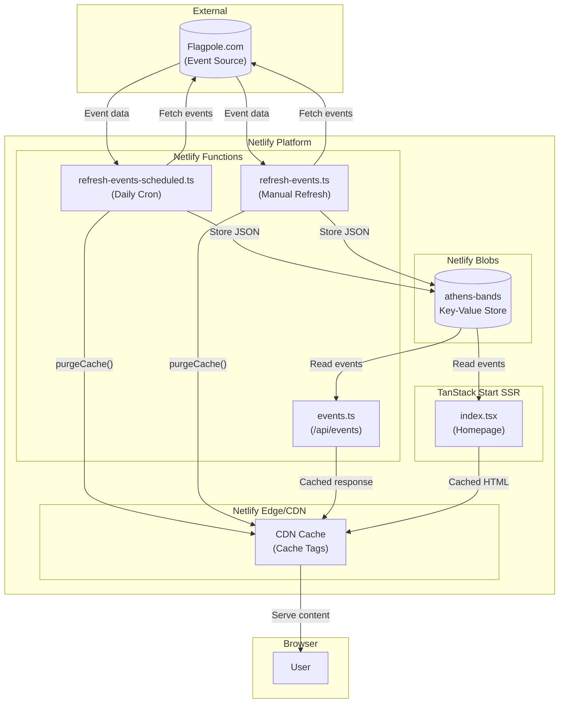

# Athens Tonight - Learn Netlify

A real-world example app demonstrating Netlify platform features with TanStack Start. This app displays live music events in Athens, GA scraped from Flagpole.com.

## Netlify Features Demonstrated

### 1. Netlify Functions

Serverless functions that run on-demand. See `netlify/functions/`:

- **`events.ts`** - API endpoint at `/api/events` that reads cached data from Blobs
- **`refresh-events.ts`** - HTTP endpoint at `/api/refresh` to manually refresh data
- **`refresh-events-scheduled.ts`** - Scheduled function that runs daily at 1 AM UTC

**Key concepts:**
```typescript
// netlify/functions/events.ts
import type { Config, Context } from '@netlify/functions'

export default async (req: Request, context: Context) => {
  return new Response(JSON.stringify(data), {
    headers: { 'Content-Type': 'application/json' }
  })
}

export const config: Config = {
  path: '/api/events'  // Custom URL path
}
```

**Scheduled functions:**
```typescript
// netlify/functions/refresh-events-scheduled.ts
export const config: Config = {
  schedule: '0 1 * * *'  // Cron syntax: daily at 1 AM UTC
}
```

### 2. Netlify Blobs

Key-value storage for persisting data between function invocations. See `src/lib/events-store.ts`:

```typescript
import { getStore } from '@netlify/blobs'

const store = getStore('athens-bands')

// Store data
await store.setJSON('events', payload)

// Retrieve data
const data = await store.get('events', { type: 'json' })
```

### 3. CDN Cache Tags & Purging

Control Netlify's CDN caching with tags and invalidation. See `netlify/functions/refresh-events.ts`:

```typescript
import { purgeCache } from '@netlify/functions'

// Set cache headers with tags
return new Response(data, {
  headers: {
    'Netlify-CDN-Cache-Control': 'public, s-maxage=43200, stale-while-revalidate=86400',
    'Netlify-Cache-Tag': 'events-data'
  }
})

// Purge cache when data updates
await purgeCache({ tags: ['events-data', 'homepage'] })
```

### 4. TanStack Start Integration

SSR with Netlify caching headers. See `src/routes/index.tsx`:

```typescript
export const Route = createFileRoute('/')({
  loader: async () => {
    const data = await getEventsData()
    return { data }
  },
  headers: () => ({
    'Netlify-CDN-Cache-Control': 'public, s-maxage=43200, stale-while-revalidate=86400',
    'Netlify-Cache-Tag': 'homepage'
  }),
  component: RouteComponent,
})
```

## Project Structure

```
├── netlify/
│   └── functions/           # Netlify Functions
│       ├── events.ts        # GET /api/events
│       ├── refresh-events.ts        # POST /api/refresh
│       └── refresh-events-scheduled.ts  # Daily cron job
├── src/
│   ├── lib/
│   │   ├── events.ts        # Event fetching logic
│   │   └── events-store.ts  # Blob storage helper
│   ├── routes/
│   │   ├── __root.tsx       # Root layout
│   │   ├── index.tsx        # Homepage
│   │   └── about.tsx        # About page
│   └── styles/
│       └── app.css          # Styles
├── netlify.toml             # Netlify configuration
├── vite.config.ts           # Vite + Netlify adapter
└── package.json
```

## Running Locally

```bash
npm install
npm run dev
```

The dev server runs at http://localhost:3000

## Deploying to Netlify

1. Push to GitHub
2. Connect repo to Netlify
3. Build settings are auto-detected from `netlify.toml`

Or use the Netlify CLI:

```bash
npx netlify deploy --build --prod
```

## Configuration

**netlify.toml:**
```toml
[build]
  command = "npm run build"
  publish = "dist/client"
```

**vite.config.ts:**
```typescript
import netlify from '@netlify/vite-plugin-tanstack-start'

export default defineConfig({
  plugins: [netlify(), ...]
})
```

## Architecture

The following diagram shows how data flows through the application:



### Data Flow Explanation

1. **Data Ingestion**: The scheduled function (`refresh-events-scheduled.ts`) runs daily at 1 AM UTC to scrape event data from Flagpole.com. Manual refreshes can also be triggered via `refresh-events.ts`.

2. **Storage**: Event data is stored in Netlify Blobs, a key-value store that persists data between function invocations.

3. **Cache Invalidation**: After storing new data, the functions call `purgeCache()` with specific cache tags to invalidate stale content.

4. **Serving**: The homepage (`index.tsx`) and API endpoint (`events.ts`) read from Blobs and serve cached responses through Netlify's CDN.

## Learn More

### Netlify Documentation

**Core Features:**
- [Netlify Functions](https://docs.netlify.com/functions/overview/) - Serverless functions that scale automatically
- [Scheduled Functions](https://docs.netlify.com/functions/scheduled-functions/) - Run functions on a cron schedule
- [Netlify Blobs](https://docs.netlify.com/blobs/overview/) - Key-value data storage for your functions
- [Caching](https://docs.netlify.com/platform/caching/) - CDN caching and cache control headers
- [Cache Tags & Purging](https://docs.netlify.com/platform/caching/#purge-cache-by-tags) - Fine-grained cache invalidation

**Configuration & Deployment:**
- [netlify.toml Reference](https://docs.netlify.com/configure-builds/file-based-configuration/) - File-based configuration
- [Deploy with CLI](https://docs.netlify.com/cli/get-started/) - Deploy from the command line
- [Environment Variables](https://docs.netlify.com/environment-variables/overview/) - Manage secrets and config

**Framework Integration:**
- [TanStack Start on Netlify](https://docs.netlify.com/frameworks/tanstack-start/) - SSR framework integration

### External Resources

- [TanStack Start Documentation](https://tanstack.com/start)
- [Netlify CLI Reference](https://cli.netlify.com/)
